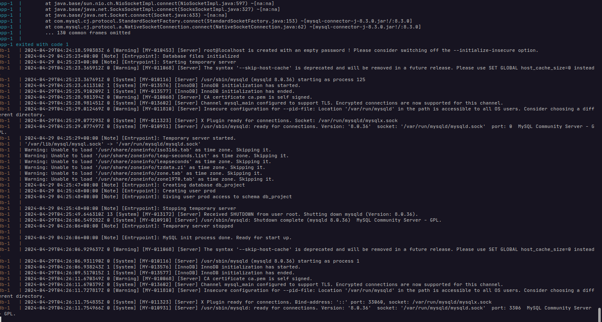

# Run Docker Image

Do this before build the image: 
* Run the life cycle of maven.
* Run package in maven to generate de jar file.
* verify the tests, all of them must pass.
* fix all errors


first at all build the image:
```shell
docker build -t nombre-de-tu-imagen .
```
> [!NOTE]
> Now, if you have problems ask chat gpt for help.

Now, check if the image is in your system: 
```shell
docker images
```

If you have docker desktop, go and check the list of images.

After that, just put the next command and run the image: 
```shell
docker run -p 8080:8080 adso
```

### Creating a container

When you need to run an image it's better run it within a container, this is going to make easier 
the process after creating the image, you can create a container with the next command:
```shell
docker run --name nombre-del-contenedor -d -p 8080:8080 adso
docker run --name adso-project -d -p 8080:8080 adso
```

With this, you can stop the container and run whenever you want.

**See the actual containers**
```shell
docker ps
```

### Compose 

Make sure the compose has no erros and run: 
```shell
docker compose up
```

### Actual logs

